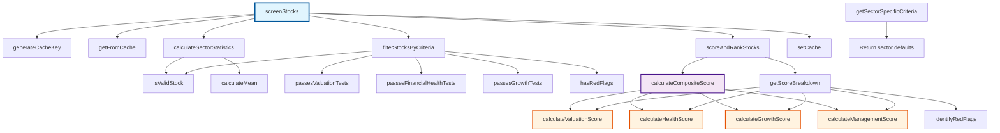

# StockScreener Call Graph

This document provides a comprehensive call graph analysis of the `StockScreener` class from `src/services/screening.js`.

## Call Graph Diagram

## Method Dependencies

### Main Entry Point
- **`screenStocks()`** (line 17) - Primary public method that orchestrates the entire screening process

### Direct Dependencies from screenStocks()
- `generateCacheKey()` (line 442) - Creates cache key from criteria
- `getFromCache()` (line 453) - Retrieves cached results
- `calculateSectorStatistics()` (line 55) - Computes sector averages
- `filterStocksByCriteria()` (line 102) - Applies screening filters
- `scoreAndRankStocks()` (line 245) - Scores and ranks results
- `setCache()` (line 462) - Stores results in cache

### Sector Statistics Chain (from calculateSectorStatistics)
- `isValidStock()` (line 427) - Validates stock data integrity
- `calculateMean()` (line 437) - Computes statistical averages for sector metrics

### Filtering Chain (from filterStocksByCriteria)
- `isValidStock()` (line 427) - Basic stock validation
- `passesValuationTests()` (line 139) - P/E, P/B, P/S ratio checks against sector averages
- `passesFinancialHealthTests()` (line 169) - ROE, debt-to-equity, cash flow checks
- `passesGrowthTests()` (line 198) - Revenue and net income growth validation
- `hasRedFlags()` (line 218) - Identifies disqualifying factors (penny stocks, excessive debt)

### Scoring Chain (from scoreAndRankStocks)
- `calculateCompositeScore()` (line 268) - Main scoring algorithm with weighted components
  - `calculateValuationScore()` (line 299) - Valuation component (40% weight)
  - `calculateHealthScore()` (line 320) - Financial health component (30% weight)
  - `calculateGrowthScore()` (line 352) - Growth metrics component (20% weight)
  - `calculateManagementScore()` (line 378) - Management efficiency component (10% weight)
- `getScoreBreakdown()` (line 398) - Provides detailed score transparency
  - Calls all four scoring methods above
  - `identifyRedFlags()` (line 411) - Lists specific concerns for transparency

### Standalone Utility Functions
- `getSectorSpecificCriteria()` (line 472) - Returns sector-specific screening defaults (independent method)

## Method Call Frequencies

### High-Traffic Methods (called multiple times per screening)
- `isValidStock()` - Called for every stock in dataset
- `calculateValuationScore()` - Called twice per qualifying stock (scoring + breakdown)
- `calculateHealthScore()` - Called twice per qualifying stock (scoring + breakdown)
- `calculateGrowthScore()` - Called twice per qualifying stock (scoring + breakdown)
- `calculateManagementScore()` - Called twice per qualifying stock (scoring + breakdown)

### Medium-Traffic Methods (called once per qualifying stock)
- `passesValuationTests()` - Called during filtering phase
- `passesFinancialHealthTests()` - Called during filtering phase
- `passesGrowthTests()` - Called during filtering phase
- `hasRedFlags()` - Called during filtering phase
- `calculateCompositeScore()` - Called during scoring phase
- `getScoreBreakdown()` - Called during scoring phase
- `identifyRedFlags()` - Called during breakdown generation

### Low-Traffic Methods (called once per screening)
- `screenStocks()` - Main entry point
- `generateCacheKey()` - Cache key generation
- `getFromCache()` - Cache retrieval attempt
- `calculateSectorStatistics()` - Sector analysis
- `filterStocksByCriteria()` - Orchestrates filtering
- `scoreAndRankStocks()` - Orchestrates scoring
- `setCache()` - Cache storage
- `calculateMean()` - Statistical calculation for sector stats

## Data Flow Summary

1. **Entry**: `screenStocks()` receives criteria and stock data
2. **Caching**: Checks cache via `generateCacheKey()` and `getFromCache()`
3. **Analysis**: `calculateSectorStatistics()` computes sector benchmarks
4. **Filtering**: `filterStocksByCriteria()` applies multiple validation layers
5. **Scoring**: `scoreAndRankStocks()` calculates weighted composite scores
6. **Output**: Returns ranked results with detailed scoring breakdowns
7. **Caching**: Stores results via `setCache()` for future use

## Performance Considerations

- Caching mechanism reduces redundant calculations (15-minute TTL)
- Sector statistics calculated once per screening session
- Scoring methods optimized for batch processing
- Early filtering eliminates low-quality stocks before expensive scoring calculations